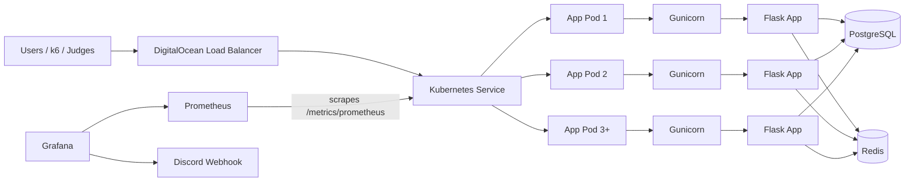

# Architecture Diagram

This is the architecture we actually built and operated for the hackathon.

## ASCII Diagram

```text
+---------------------+
| Users / k6 / Judges |
+---------------------+
           |
           v
+---------------------------+
| DigitalOcean LoadBalancer |
+---------------------------+
           |
           v
+--------------------+
| Kubernetes Service |
+--------------------+
           |
           v
+-----------------------------------------------+
| url-shortener Deployment (3+ app pods)        |
|                                               |
|  +------------------+    +------------------+ |
|  | App Pod          |    | App Pod          | |
|  | Gunicorn         |    | Gunicorn         | |
|  | Flask App        |    | Flask App        | |
|  +------------------+    +------------------+ |
|                                               |
|  +------------------+                         |
|  | App Pod          |                         |
|  | Gunicorn         |                         |
|  | Flask App        |                         |
|  +------------------+                         |
+-----------------------------------------------+
        |                       |           |
        v                       v           v
+---------------+      +---------------+   +----------------+
| PostgreSQL    |      | Redis Cache   |   | /metrics/prom. |
+---------------+      +---------------+   +----------------+
                                                |
                                                v
                                         +-------------+
                                         | Prometheus  |
                                         +-------------+
                                                |
                                                v
                                         +-------------+
                                         | Grafana     |
                                         +-------------+
                                                |
                                                v
                                         +-------------+
                                         | Discord     |
                                         | Webhook     |
                                         +-------------+
```

## Mermaid Diagram



## Notes

- the app runs as a Kubernetes `Deployment`
- replicas are fronted by a `LoadBalancer` service
- each pod serves traffic through Gunicorn, which hosts the Flask app workers
- Prometheus scrapes the app metrics endpoint
- Grafana is used for dashboards and live alert delivery to Discord
- Redis is only used for short-code caching, not as a primary datastore
