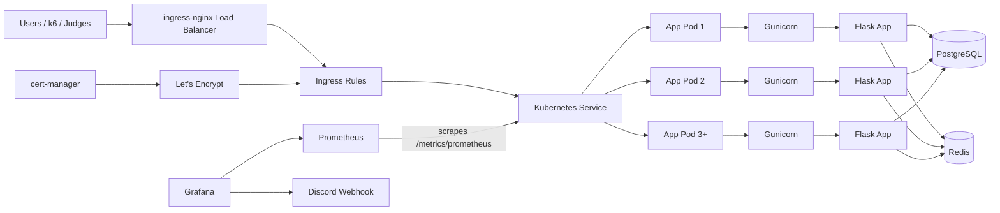

# Architecture Diagram

This is the architecture we actually built and operated for the hackathon.

## ASCII Diagram

```text
+---------------------+
| Users / k6 / Judges |
+---------------------+
           |
           v
+----------------------------------+
| ingress-nginx LoadBalancer       |
| 134.199.241.177                  |
+----------------------------------+
           |
           v
+--------------------------------------+
| Ingress Rules                        |
| fifaurlshortener.duckdns.org         |
| grafana.*.nip.io / prometheus.*.nip.io |
+--------------------------------------+
      |                     |
      v                     v
+--------------------+   +-----------------------------+
| App Service        |   | Monitoring Services         |
| url-shortener      |   | Grafana / Prometheus        |
+--------------------+   +-----------------------------+
           |
           v
+-----------------------------------------------+
| url-shortener Deployment (3+ app pods)        |
|                                               |
|  +------------------+    +------------------+ |
|  | App Pod          |    | App Pod          | |
|  | Gunicorn         |    | Gunicorn         | |
|  | Flask App        |    | Flask App        | |
|  +------------------+    +------------------+ |
|                                               |
|  +------------------+                         |
|  | App Pod          |                         |
|  | Gunicorn         |                         |
|  | Flask App        |                         |
|  +------------------+                         |
+-----------------------------------------------+
        |                       |           |
        v                       v           v
+---------------+      +---------------+   +----------------+
| PostgreSQL    |      | Redis Cache   |   | /metrics/prom. |
+---------------+      +---------------+   +----------------+
                                                |
                                                v
                                         +-------------+
                                         | Prometheus  |
                                         +-------------+
                                                |
                                                v
                                         +-------------+
                                         | Grafana     |
                                         +-------------+
                                                |
                                                v
                                         +-------------+
                                         | Discord     |
                                         | Webhook     |
                                         +-------------+

+------------------+         +----------------+
| cert-manager     | ------> | Let's Encrypt  |
+------------------+         +----------------+
          \___________________________/
                      |
                      v
             issues TLS for ingress
```

## Mermaid Diagram



## Notes

- the app runs as a Kubernetes `Deployment`
- public traffic enters through `ingress-nginx`, not directly through the app service
- the main app is exposed at `https://fifaurlshortener.duckdns.org`
- TLS is issued by Let's Encrypt through `cert-manager` using `config/letsencrypt-issuer.yml`
- application routing is defined in `config/app-ingress.yml`
- Grafana and Prometheus are exposed separately through `config/monitoring/monitoring-ingress.yml`
- each pod serves traffic through Gunicorn, which hosts the Flask app workers
- Prometheus scrapes the app metrics endpoint
- Grafana is used for dashboards and live alert delivery to Discord
- Redis is only used for short-code caching, not as a primary datastore
